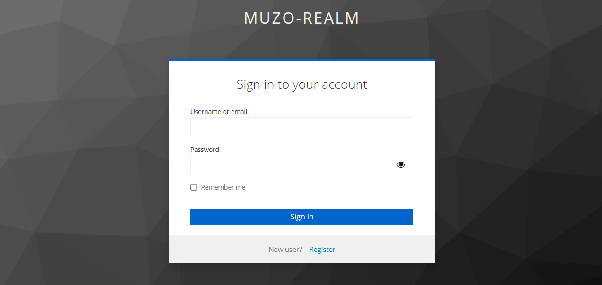
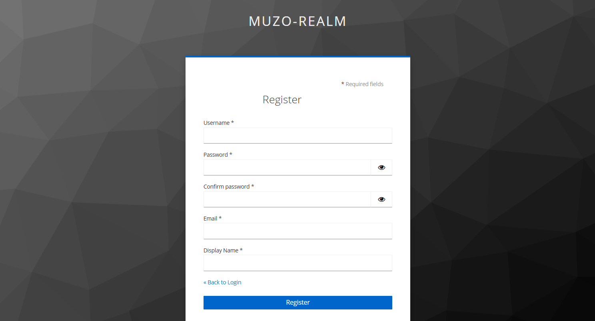
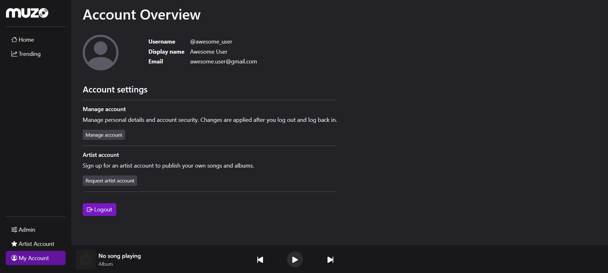
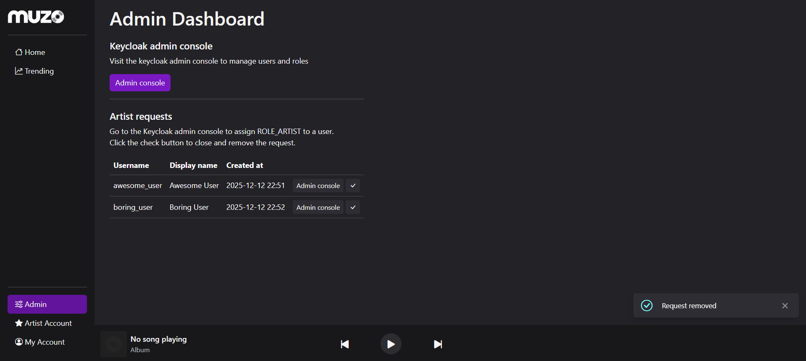
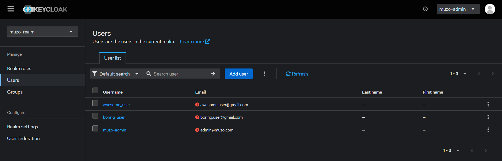

# Muzo - Distributed Audio Streaming Platform

## Setup 

### Build web api image

    cd backend
    docker build . -t muzo-web

### Deploy stack

    docker stack deploy -c stack.yml muzo

### Access

 * Web API: http://localhost:5000
 * Keycloak: http://localhost:8080

### Keycloak Access

#### Master realm
* http://localhost:8080/admin/master/console
* username: admin
* password: admin

#### Muzo realm

The realm is seeded with a realm-level admin user, with user and role management permissions
* http://localhost:8080/admin/muzo-realm/console
* username: muzo-admin
* password: pass

## Components

### Auth module

The app uses Keycloak for user authentication and account registration

After logging in, users are added or updated in the database based on the data stored in the access token. 

### User roles

Roles and permissions:

* ROLE_USER - default role of any user with an account
    * Access _My Account_ page in web api
    * Request artist account
    * Change display name, email and password in keycloak account console
* ROLE_ARTIST
    * Access _Artist Page_
* ROLE_ADMIN - composite role (view_realm, view_users, manage_users)
    * Access _Admin_ page
    * View and delete artist account requests
    * View realm, manage users and roles in keycloak admin console

#### Access control

Access to resources is granted based on the roles stored in the access token

#### Role management

Roles are managed by admins in the Keycloak admin console

* ROLE_USER is automatically granted on sign up
* ROLE_ARTIST:
    * A user can request an artist account from the _My Account_ page
    * Admins can see the requests in the _Admin_ dashboard and grant the role in the keycloak admin console
* ROLE_ADMIN
    * The admin role can be granted by an existing admin in the keycloak admin console

### Database

The app uses a Postgres database to store users, artists and artist requests. 

The artists table is a subset of users.

The ORM used is SQLAlchemy