# Muzo - Distributed Audio Streaming Platform

A distributed, microservices-based audio streaming platform built with Docker Swarm

It supports music discovery, on-demand streaming and content publishing in a horizontally scalable system

Features:
* Replicated streaming workers
* Full-text search across songs, albums and artists using OpenSearch
* Single Sign-On (SSO) via OAuth2/OpenID Connect (OIDC)
* Role-Based Access Control (RBAC) with ownership-based permissions
* Signed, expiring streaming URLs (HMAC-based)
* Real-time statistics through Grafana

## Preview

__Artist page__

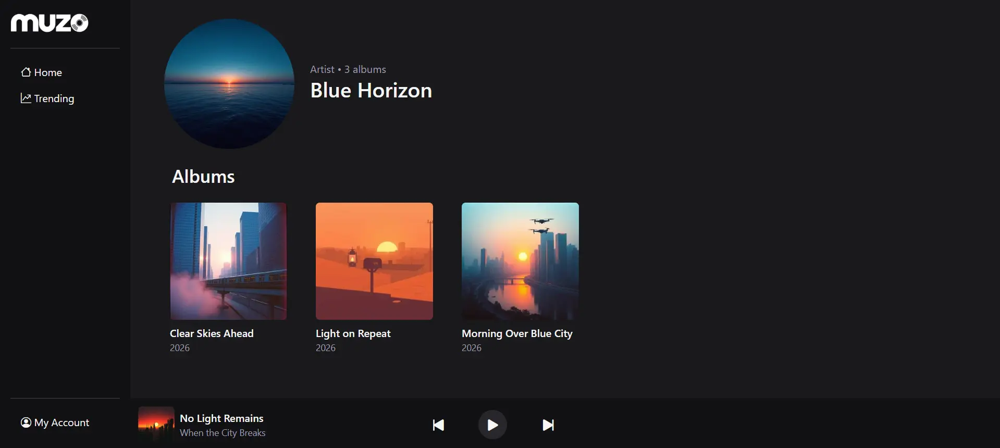

__Album page__

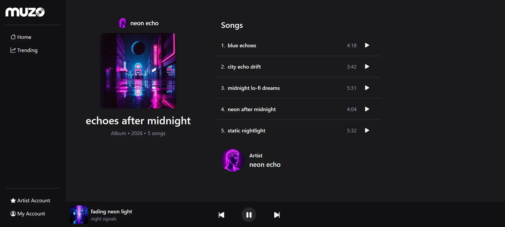

__Search results__

Demo names and images are AI-generated

## Architecture Overview

### Services

#### Web API (Python, Flask, SQLAlchemy)
* Central application service handling REST endpoints, authentication, authorization, persistence and search indexing
* Generates signed streaming URLs
* Renders the frontend using Jinja templates, Bootstrap and JavaScript

#### Streaming Service (replicated)
* Dedicated audio delivery service supporting full and HTTP range requests
* Validates signed URLs and runs with multiple replicas for horizontal scalability

#### Keycloak
* Centralized identity provider implementing OIDC
* Issues JWT tokens consumed by the Web API

#### PostgreSQL
* Persistent storage for users, artists, albums, songs and play history

#### OpenSearch
* Full-text search engine powering search suggestions and filtered results

#### Grafana
* Dashboard visualization for platform statistics powered by PostgreSQL queries

### Volumes
* `audio_data` - stores audio files, shared between Web API and Streaming Service
* `images_data` - stores album cover and artist avater images
* `postgres_data`, `opensearch_data`, `keycloak_data`, `grafana_data` - services persistance

### Networks

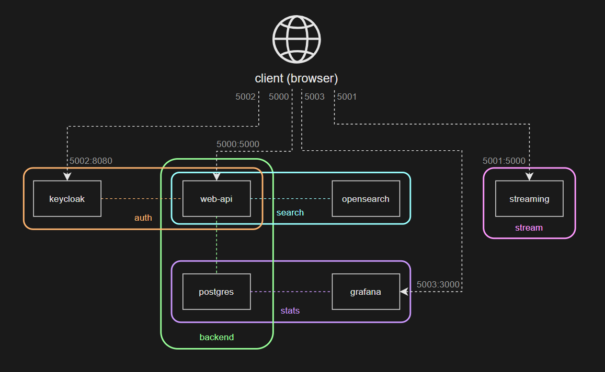

## Core Flows

### Authentication

Implements OIDC Authorization Code Flow using Keycloak  
The Web API validates JWT tokens, syncs user identity in PostgreSQL and enforces RBAC based on extracted roles

### Search
Queries OpenSearch for fast suggestions and consilidates full results with PostgreSQL

### Streaming
1. Client requests streaming URL from Web API
2. Web API retrieves song metadata from PostgreSQL and generates a HMAC-signed, expiring streaming URL
3. The frontend sets the signed URL as audio source
4. The browser requests audio directly from the replicated Streaming Service
5. Streaming Service validates the signature and expiration, reads the file from shared storage and streams the bytes to the client

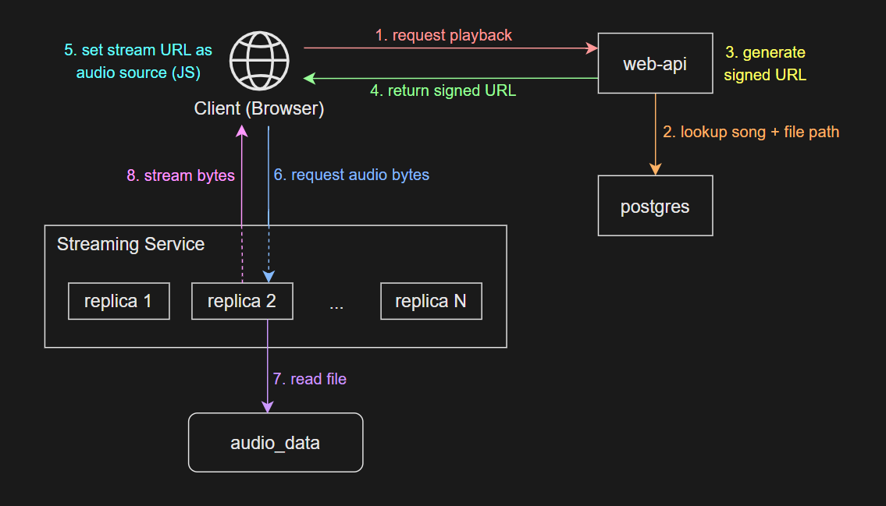

## Access Control
* Role-Based Access Control
    * `ROLE_USER` - search and stream content
    * `ROLE_ARTIST` - create and manage own albums/songs
    * `ROLE_ADMIN` - manage users and roles, trigger reindexing
* Ownership-based permissions for album and song management
* Draft vs public album visibility

## Features Summary
* Microservices architecture
* Docker Swarm orchestration
* Replicated streaming workers
* Centralized identity provider (SSO)
* Eventual consistency with search indexing
* HMAC-signed straming URLs
* Overlay network isolation

## Build and Deploy

    make build
    make deploy

## Testing

Postman collection included in [tests/collection.json](tests/collection.json) covers authentication, access control, CRUD operations, search indexing and streaming functionality

Run with

    newman run collection.json -e env.json --delay-request 300

[Tests results](tests/test-results)

## Screenshots

__Home page__

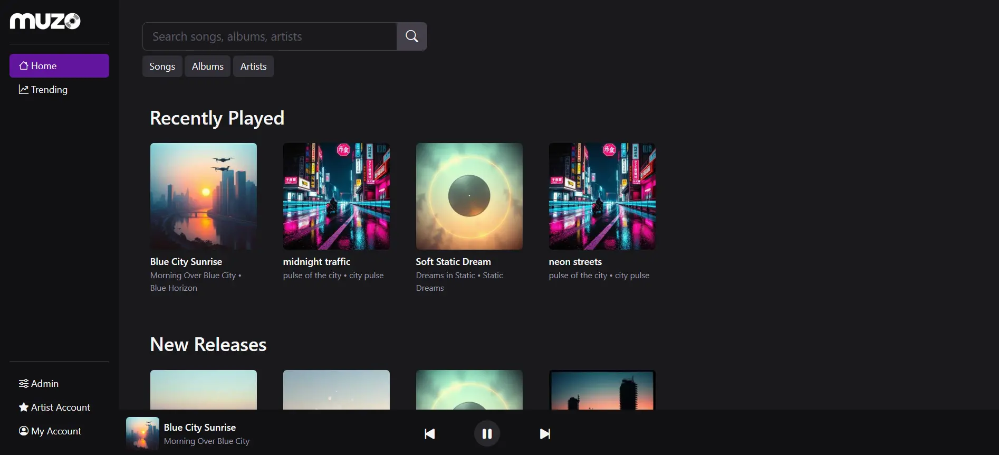

__Search suggestions__

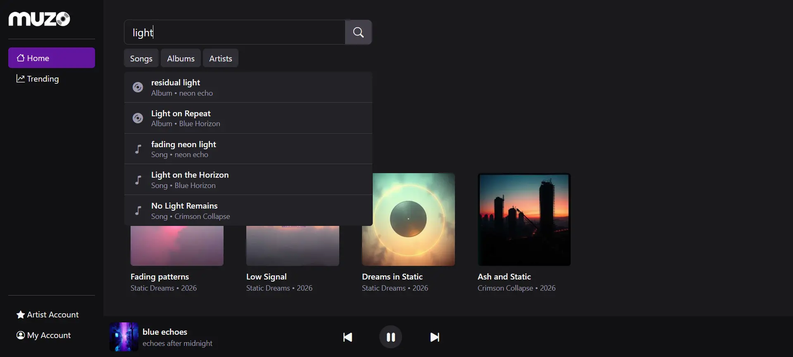

Trending page

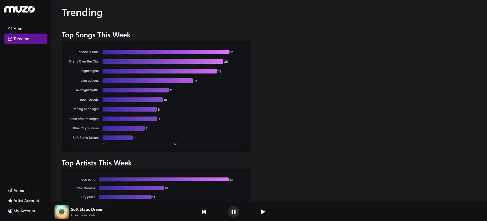

__Account page__

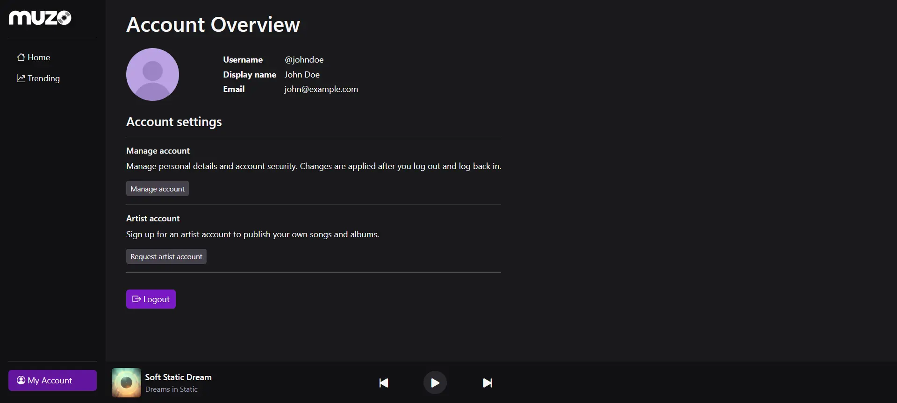

__Admin dashboard__

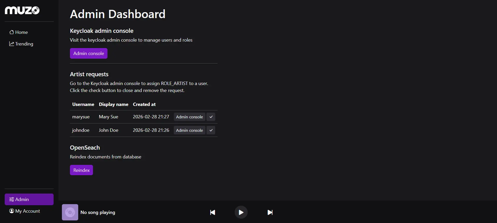

__Artist account__

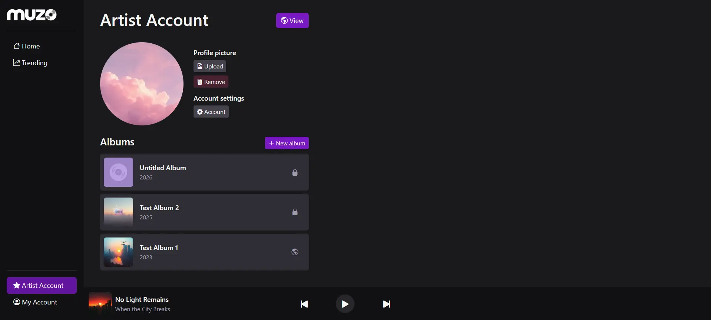

__Album edit page__

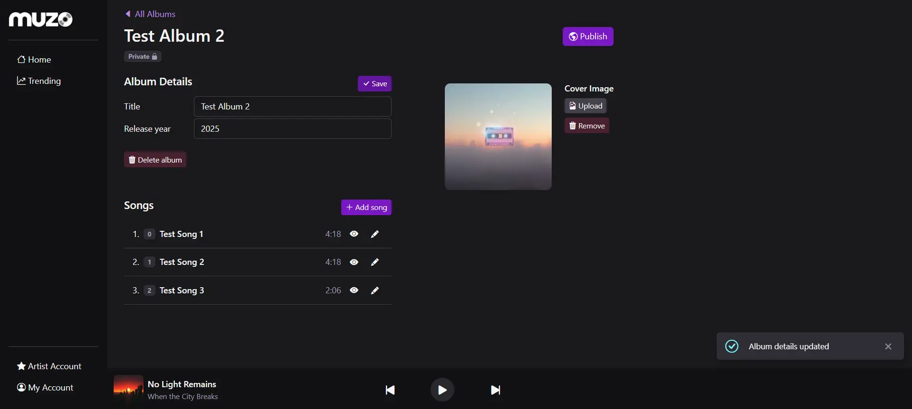
