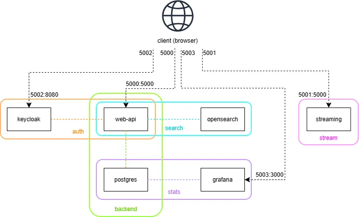
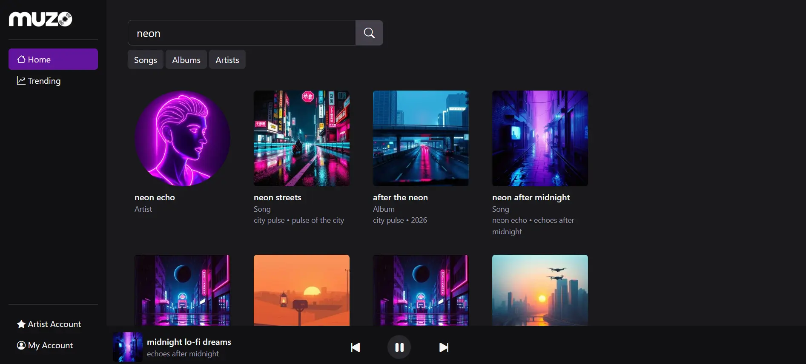
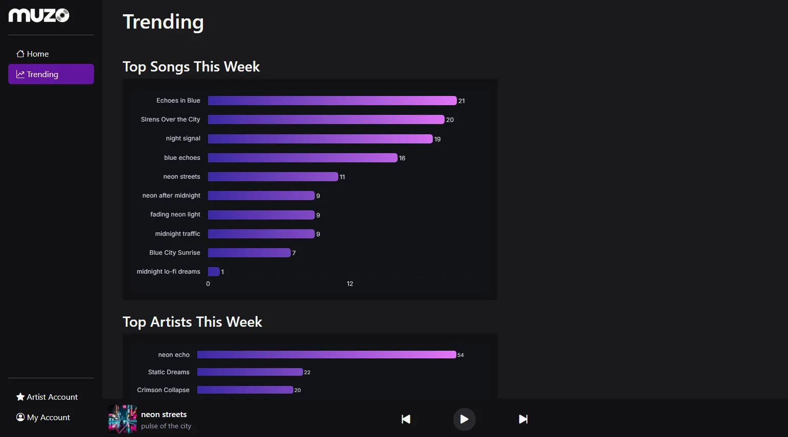
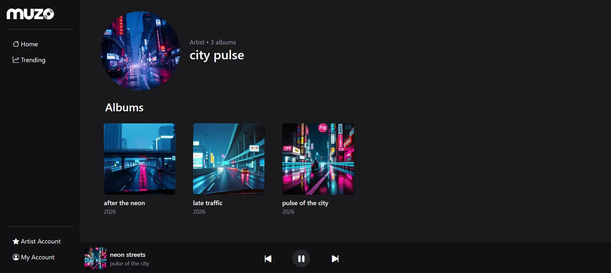
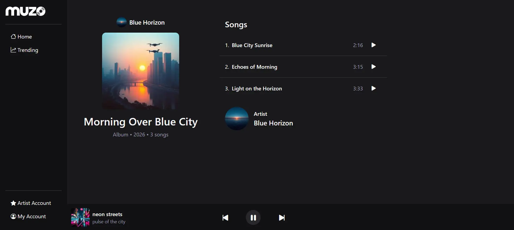
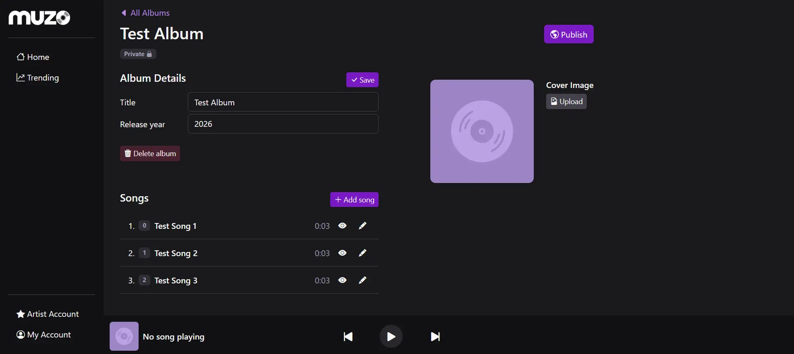

# Muzo - Distributed Audio Streaming Platform

This project implements a distributed audio streaming platform where users can search and stream music and artists can upload and manage content.

1. [Architecture - Components, Volumes, Networks](#architecture)
2. [Flows - Authentication, Streaming, Search](#flows) 
3. [REST API](#rest-api)
4. [Access Control and Security](#access-control-and-security)
5. [Consistency](#consistency)
6. [Build and Deploy](#build-and-deploy)
7. [Tests](#tests)
8. [Screenshots](#screenshots)

## Architecture

### Components

#### 1. Web API
- Central service that handles application logic, REST endpoints and access control
- Implements both backend (Python, Flask) and frontend (Jinja templates, JS, Bootstrap)
- Communicates with Postgres (using SQLAlchemy), Keycloak (auth) and OpenSearch (search)
- Generates signed streaming URLs (without streaming audio directly)

#### 2. Streaming service (replicated)
- Flask service responsible for streaming audio files to clients
- Handles full content and range requests to communicate directly with the browser
- Deployed in replicated mode

#### 3. Keycloak
- Responsible for user authentication and registration
- Manages user roles and identity (username, email, display name)
- Issues authentication tokens, Web API reads identity and roles directly from the token

#### 4. Postgres
- Relational database used for persistent storage of application data
- Tables:
    - users (id, username, keycloak_id, email, username, display_name, created_at)
    - artists (id [fk users.id], avatar_file)
    - artist_requests (user_id, created_at)
    - albums (id, title, cover_file, release_year, published, published_at, artist_id [fk artists.id])
    - songs (id, title, duration, position, audio_file, album_id [fk albums.id])
    - plays (id, played_at, song_id [fk songs.id], user_id [fk users.id])

#### 5. OpenSearch
- Used for fast searching of songs, albums and artists
- Stores all data in a single index to simplify query logic and allow aggregated results of all 3 types 
- Document: title, type (artist/album/song), id, artist (only for song/album), url
- Supports full-text search by name and filtering by type (keyword)

#### 6. Grafana
- Used for visualization of application statistics
- Connected to Postgres as data source to display play statistics (top songs and top artists in the last 7 days)
- Dashboards are embedded in the frontend as iframes

### Volumes

- images_data
    - Used by Web API
    - Stores album covers (/covers) and artist avatar (/avatars)
- audio_data
    - Web API saves audio files, Streaming service serves files to clients
- keycloak_data, postgres_data, openseach_data, grafana_data
    - persistent storage for each service

### Networks

## Flows

### Authentication

#### Browser
- User clicks _Continue with Keycloak_ on login page and is redirected to Keycloak for login/registration
- Keycloak redirects back to the Web API callback with an authorization code
- Web API exchanges the code for a token, extracts identity and roles, syncs the user in the database and creates an app session
- User is redirected to the home page

#### API
- Client calls Keycloak token endpoint directly to obtain an access token
- The token is placed in the _Authorization: Bearer_ header of subsequest requests
- Web API validates the token and syncs the user in the database if needed

### Streaming
- Client sends a request to Web API for a streaming URL
- Web API generates a signed URL
- In browser, the frontend sets the url as player audio source
- The browser or client requests full/range audio directly from the streaming service
- Streaming service verifies the url parameters and serves data

### Search
- Client sends a request to Web API containing name and optionally type
- Web API queries OpenSearch, obtains and parses the results list
- Search suggestions are returned directly from OpenSearch, full search results are consolidated from the database

## REST API

The Web API and streaming service expose REST interfaces that follow standard conventions for methods (GET, POST, PUT, DELETE), resource-oriented endpoints and appropriate status codes for errors and success 

## Access Control and Security

### Web API

- Authentication:
    - Session - created after login through brrowser flow
    - Token Bearer - for direct API calls
- Role based authorization:
    - Access is enforced based on roles, an account can have multiple roles at the same time
    - ROLE_USER: default; can browse, search and stream songs
    - ROLE_ARTIST: can create albums, upload songs and manage their own content
    - ROLE_ADMIN: can manage users/roles in the Keycloak console; can trigger OpenSearch reindexing
- Role management flow:
    - User role is automatically assigned to all users upon registration
    - Artist role can be requested within the app: normal users can create an artist request; admin users can see or remove the requests, and assign the role in Keycloak console
    - Admin role can be assigned by another admin in Keycloak
- Ownership based access:
    - Artists can only create, edit and delete their own albums and songs
- Visibility:
    - Albums are created as drafts (private) and can only be viewed by the owner artist until they are published. Songs on private albums are also protected

### Streaming

- Web API creates a streaming URL with an expiration and a signature
- `{streaming}/stream/{filename}?exp={exp}&sig={sig}`
- `signature = hmac(secret, 'filename+exp')`
- Streaming service checks the expiration, then computes and compares the signature using the shared secret

## Consistency

- All database operations happen within request-scoped sessions, ensuring that each request is handled atomically and consistently
- When an album is deleted, all songs are deleted along with it
- Audio files are deleted together with the corresponding song, ensuring the streaming service cannot serve content that no longer exists in the db
- User identity is managed in Keycloak and synchronized into Postgres based on the information in the access token. The sync happens on login or if the authorization header is present in the request
- OpenSearch:
    - If an artist changed their display name in Keycloak, all their albums and songs are reindexed to contain the updated artist name (on login/token)
    - When an album is published/deleted, it is bulk indexed/deleted along with all its songs
    - Temporary inconsistencies can exist for a short time while OpenSearch indexes/deletes documents. Outdated documents may appear in search suggestions, but full search results are validated with info from the database

## Build and Deploy

### Build images

    docker build backend -t muzo-web
    docker build streaming -t muzo-streaming

### Deploy

    docker stack deploy -c stack.yml muzo

### Seeded users

    user1:pass   [ROLE_USER]
    artist1:pass [ROLE_USER, ROLE_ARTIST]
    artist2:pass [ROLE_USER, ROLE_ARTIST]
    admin1:pass  [ROLE_USER, ROLE_ADMIN]

## Tests

[tests/collection.json](tests/collection.json) tests authorization, access control, crud operations, data validation, consistency, search and streaming functionality

### Run

In `tests/`:

    newman run collection.json -e env.json --delay-request 300

or import the [collection](tests/collection.json) and [environment](tests/env.json) into Postman

A small delay ensures OpenSearch data is synchonized

### Results

[test results](tests/test-results)

## Screenshots

demo names and images are ai generated

### Search suggestions

### Search results

### Trending

### Artist page

### Album page

### Album edit page
